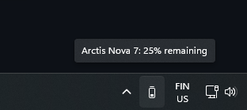

# Arctis Battery Indicator

Adds a small icon to the "system tray" area of the Windows task bar, which displays the battery level of any connected SteelSeries Arctis headphone.

## Features

* Works on Windows 10+
* Built using Rust, with very low resource usage (<1MB RAM)
* Supports all known Arctis headphones

## Installation

* Download the [latest release](https://github.com/aarol/arctis-battery-indicator/releases/latest) ZIP file and extract it somewhere.

* Right click `Install.ps1` and run the PowerShell script.

You can also update the program by downloading a new version and running `Install.ps1`.

## Troubleshooting

If you're experiencing crashes or other issues, you can try running the `arctis-battery-indicator-debug.exe` located at `%localAppData%\ArctisBatteryIndicator` or look at the log file located in the same folder.

### Why does it only show 100%, 75%, 50%, 25% or 0%?

This is limitation of the headphones themselves, as the device only exposes 5 possible battery states.

### My headphones are connected, but it still shows "No headphone adapter found"

Your headphones might be unsupported due to being a newer model. Either [create a new issue](https://github.com/aarol/arctis-battery-indicator/issues/new) or see [Adding a new headphone](#adding-a-new-headphone)

## Development

Rust and Cargo need to be installed.

* Running the application: `cargo run --release`

* Installing the application locally: `cargo install`

## Todo

* Show rough estimations for battery remaining battery life (in hours)
  * Need to figure out if the battery states are distributed evenly or not

## Adding a new headphone

Add a new entry to the bottom of `KNOWN_HEADPHONES` in [hid.rs](src/hid.rs#L142) and submit a new pull request.

The parameters, such as `write_bytes` and `battery_percent_idx` can be discovered by sniffing the USB traffic with something like [WireShark](https://www.wireshark.org/) and [USBPcap](https://desowin.org/usbpcap/)
